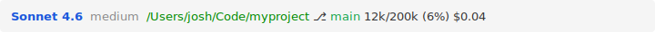

# claude-statusline

A custom status line for [Claude Code](https://claude.ai/code) that displays model, effort level, working directory, git branch status, context window usage, and session cost.

## How it looks



The git branch is color-coded: **green** when clean, **yellow** when ahead of remote, and **red** when there are uncommitted changes.

If you're on a Claude Pro or Max plan, a second line shows your 5-hour and 7-day usage with reset countdowns. This line is hidden if you're not on a plan.

## Installation

Add the following to your `.claude/settings.json` (global: `~/.claude/settings.json`, or local: `.claude/settings.json` in your project):

```json
{
  "statusLine": {
    "type": "command",
    "command": "npx -y github:kennedyjosh/claude-statusline"
  }
}
```

## Requirements

- `jq` — for parsing JSON input
- `python3` — for formatting usage data
- `curl` — for fetching plan usage from the API
- `git` — for branch/status info
